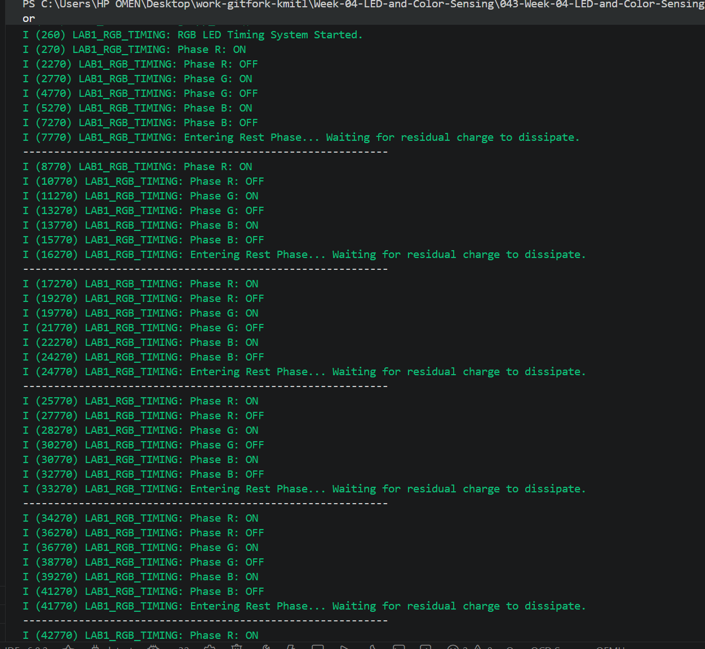

# ใบงานปฏิบัติการ สัปดาห์ที่ 4 การทดลองย่อยที่ 1


### หัวข้อ: การควบคุมจังหวะเวลาเอาต์พุตดิจิทัล (Time-Domain Multiplexing with RGB LED)

### 1. วัตถุประสงค์

1. เพื่อให้ผู้เรียนสามารถควบคุมขาสัญญาณดิจิทัลเอาต์พุต (GPIO) โดยใช้เฟรมเวิร์ก ESP-IDF 
    
2. เพื่อให้ผู้เรียนสามารถจัดการจังหวะเวลาทางกายภาพ (Transient & Steady States) ผ่านฟังก์ชัน FreeRTOS ในโปรแกรม
    
3. เพื่อฝึกฝนการเขียนลูปสลับสถานะของสัญญาณ (Active Phase) และการเว้นระยะพักประจุระบบ (Rest Phase) ก่อนนำไปใช้ในงาน Active Sensing
    

### 2. อุปกรณ์ที่ใช้ในการทดลอง

1. บอร์ดไมโครคอนโทรลเลอร์ ESP32  จำนวน 1 บอร์ด
    
2. หลอด LED สามสี (RGB LED) ชนิด Common Cathode หรือ Common Anode จำนวน 1 ดวง
    
3. ตัวต้านทาน (Resistor) ขนาด $330 \Omega$ หรือ $470 \Omega$ จำนวน 3 ตัว
    
4. โฟโต้บอร์ด (Breadboard) และสายจัมเปอร์ (Jumper Wires)
    

### 3. วงจรการทดลองและการคำนวณทางกายภาพ

ในโลกกายภาพ รอยต่อ PN ของ LED แต่ละสีมีแรงดันตกคร่อมและคุณสมบัติความจุไฟฟ้าแฝงต่างกัน 

นักศึกษาต้องต่อตัวต้านทานอนุกรมเข้ากับขา **GPIO4 (สีแดง)**, **GPIO5 (สีเขียว)**, และ **GPIO6 (สีน้ำเงิน)**  เพื่อจำกัดกระแสไฟฟ้าไม่ให้ชิปเกิดความเสียหาย
(หมายเหตุ ถ้าบอร์ดของนักศึกษาเป็น ESP32 ที่มี flash memory ในโมดูล ต้องเปลี่ยน GPIO6 เป็นขาอื่น เนื่องจากถูกใช้กับ flash memory)


**รูปที่ 1** LED Common Cathode

จากรูปที่ 1 เราสามารถหาค่ากระแสได้ดังตารางนี้

$I_{LED} = \frac {(V_s-V_{LED})}{R}$


กระแสและกำลังที่  LED แต่ละสี

| LED สี  | แรงดันตกคร่อม (ค่าเฉลี่ย: โวลต์) | กระแส                        | กำลังงาน                                      |
| :------ | :------------------------------- | :--------------------------- | :-------------------------------------------- |
| แดง     | 1.8                              | ${(3.3-1.8)}/{470} = 3.19mA$ | $P=E \times I$ = $1.8V \times 3.19mA =5.7mW$  |
| เขียว   | 2.0                              | ${(3.3-2.0)}/{470} = 2.77mA$ | $P=E \times I$ = $2.0V \times 2.77mA =5.54mW$ |
| น้ำเงิน | 3.0                              | ${(3.3-3.0)}/{470} = 0.64mA$ | $P=E \times I$ = $3.0V \times 0.64mA =1.92mW$ |


**รูปที่ 2** LED Common Anode

กระแสและกำลังที่  LED แต่ละสี

| LED สี  | แรงดันตกคร่อม (ค่าเฉลี่ย: โวลต์) | กระแส                        | กำลังงาน                                       |
| ------- | -------------------------------- | ---------------------------- | :--------------------------------------------- |
| แดง     | 1.8                              | ${(5.0-1.8)}/{470} = 6.81mA$ | $P=E \times I$ = $1.8V \times 6.81mA =12.26mW$ |
| เขียว   | 2.0                              | ${(5.0-2.0)}/{470} = 6.38mA$ | $P=E \times I$ = $2.0V \times 6.38mA =12.76mW$ |
| น้ำเงิน | 3.0                              | ${(5.0-3.0)}/{470} = 4.25mA$ | $P=E \times I$ = $3.0V \times 4.25mA =12.76mW$ |
|         |                                  |                              |                                                |
#### **หมายเหตุ**
ถ้า LED ที่ได้มาเป็น Common Anode ให้ต่อ common เข้าไฟ +5.0 โวลต์ แต่ยังคงใช้ Resistor ค่าเดิม
ส่วนการเขียนโปรแกรมต้องกลับค่าบิตให้ตรงตามชนิด LED

#### 3.1 ตัวอย่างซอร์สโค้ดการทดลอง (`main.c`)

ให้นักศึกษาศึกษาโค้ดต่อไปนี้ และกรอกส่วนจังหวะเวลาให้ทำงานตรงตามเงื่อนไข: **ติดดับสลับกันทีละสีดวงละ 2.5 วินาที และเมื่อดับครบหมดทุกสี ให้เว้นระยะพักรอบ 3 วินาที**


```C
#include <stdio.h>
#include "freertos/FreeRTOS.h"
#include "freertos/task.h"
#include "driver/gpio.h"
#include "esp_log.h"

static const char *TAG = "LAB1_RGB_TIMING";

// กำหนดขา GPIO ตามผังวงจร
#define LED_R_GPIO        GPIO_NUM_4
#define LED_G_GPIO        GPIO_NUM_5
#define LED_B_GPIO        GPIO_NUM_6

// กำหนดเวลาหน่วง (หน่วยมิลลิวินาที) ตามเงื่อนไขของใบงาน
#define TIME_ACTIVE_MS    2500  // สลับติด-ดับทุกๆ 2.5 วินาที
#define TIME_REST_MS      3000  // เว้นระยะพักรอบวงลูป 3 วินาที

void init_rgb_gpio(void)
{
    // โครงสร้างการตั้งค่าขา GPIO สไตล์ ESP-IDF ธรรมดา
    gpio_config_t io_conf = {
        .pin_bit_mask = (1ULL << LED_R_GPIO) | (1ULL << LED_G_GPIO) | (1ULL << LED_B_GPIO),
        .mode = GPIO_MODE_OUTPUT,              // ตั้งเป็นขา Output
        .pull_up_en = GPIO_PULLUP_DISABLE,
        .pull_down_en = GPIO_PULLDOWN_DISABLE,
        .intr_type = GPIO_INTR_DISABLE
    };
    gpio_config(&io_conf);

    // เริ่มต้นให้ LED ทุกสีดับสนิท
    gpio_set_level(LED_R_GPIO, 0);  // ถ้า common anode ต้องแก้เป็น gpio_set_level(LED_R_GPIO, 1); 
    gpio_set_level(LED_G_GPIO, 0);  // ถ้า common anode ต้องแก้เป็น gpio_set_level(LED_G_GPIO, 1); 
    gpio_set_level(LED_B_GPIO, 0);  // ถ้า common anode ต้องแก้เป็น gpio_set_level(LED_B_GPIO, 1); 
}

void app_main(void)
{
    init_rgb_gpio();
    ESP_LOGI(TAG, "RGB LED Timing System Started.");

    while (1) {
        // -----------------------------------------------------------
        // เฟสที่ 1: จ่ายแสงสีแดง (Red Phase)
        // -----------------------------------------------------------
        ESP_LOGI(TAG, "Phase R: ON");
        gpio_set_level(LED_R_GPIO, 1);
        vTaskDelay(pdMS_TO_TICKS(TIME_ACTIVE_MS));
        
        gpio_set_level(LED_R_GPIO, 0);
        ESP_LOGI(TAG, "Phase R: OFF");

        // -----------------------------------------------------------
        // เฟสที่ 2: จ่ายแสงสีเขียว (Green Phase)
        // -----------------------------------------------------------
        ESP_LOGI(TAG, "Phase G: ON");
        gpio_set_level(LED_G_GPIO, 1);
        vTaskDelay(pdMS_TO_TICKS(TIME_ACTIVE_MS));
        
        gpio_set_level(LED_G_GPIO, 0);
        ESP_LOGI(TAG, "Phase G: OFF");

        // -----------------------------------------------------------
        // เฟสที่ 3: จ่ายแสงสีน้ำเงิน (Blue Phase)
        // -----------------------------------------------------------
        ESP_LOGI(TAG, "Phase B: ON");
        gpio_set_level(LED_B_GPIO, 1);
        vTaskDelay(pdMS_TO_TICKS(TIME_ACTIVE_MS));
        
        gpio_set_level(LED_B_GPIO, 0);
        ESP_LOGI(TAG, "Phase B: OFF");

        // -----------------------------------------------------------
        // เฟสที่ 4: ระยะพักระบบ (Rest Phase / Discharge Window)
        // -----------------------------------------------------------
        ESP_LOGI(TAG, "Entering Rest Phase... Waiting for residual charge to dissipate.");
        
        // หน่วงเวลาพักระบบ 3 วินาทีก่อนกลับไปเริ่มสีแดงใหม่
        vTaskDelay(pdMS_TO_TICKS(TIME_REST_MS)); 
        
        printf("-----------------------------------------------------------\n");
    }
}
```

#### 3.2 ไฟล์ `main/CMakeLists.txt`

เพื่อลงทะเบียนระบบพอร์ตและ GPIO ให้โปรเจกต์คอมไพล์ผ่านอย่างถูกต้อง แนะนำให้นักศึกษาใช้โครงสร้าง CMake พื้นฐานดังนี้


```CMake
idf_component_register(SRCS "main.c"
                    INCLUDE_DIRS "."
                    REQUIRES driver)
```

### 4.  บันทึกผลการทดลอง 

#### 4.1 จาก `idf.py monitor` 

```


```

#### 4.2 จากการสังเกตุ LED 
ผลการทดลอง
LED สีแดงติดเป็นเวลา 2 วินาที จากนั้นดับ 0.5 วินาที
LED สีเขียวติดเป็นเวลา 2 วินาที จากนั้นดับ 0.5 วินาที
LED สีน้ำเงินติดเป็นเวลา 2 วินาที จากนั้นดับ 0.5 วินาที
หลังจากครบทั้ง 3 สี ระบบจะเข้าสู่ช่วงพัก 1 วินาที
เมื่อครบ 1 วินาที โปรแกรมจะกลับไปเริ่มที่ LED สีแดง และทำงานวนซ้ำอย่างต่อเนื่อง

สรุปผลการทดลอง
โปรแกรมสามารถควบคุม RGB LED ได้ตามลำดับ สีแดง → สีเขียว → สีน้ำเงิน โดยแต่ละสีติดเป็นเวลา 2 วินาที และดับ 0.5 วินาที ก่อนเปลี่ยนไปยังสีถัดไป จากนั้นระบบจะเว้นช่วงพัก 1 วินาที แล้วเริ่มการทำงานใหม่อีกครั้ง การทดลองแสดงให้เห็นว่าสามารถควบคุมการทำงานของ GPIO และการหน่วงเวลาด้วย FreeRTOS ได้อย่างถูกต้อง รวมทั้งเข้าใจหลักการสลับช่วงเวลาการทำงาน (Time-Domain Multiplexing) ของ LED RGB ตามวัตถุประสงค์ของการทดลอง

link youtube : https://youtube.com/shorts/GlvBL30FCWw?si=aTpTQnpfVwD8kbT9


