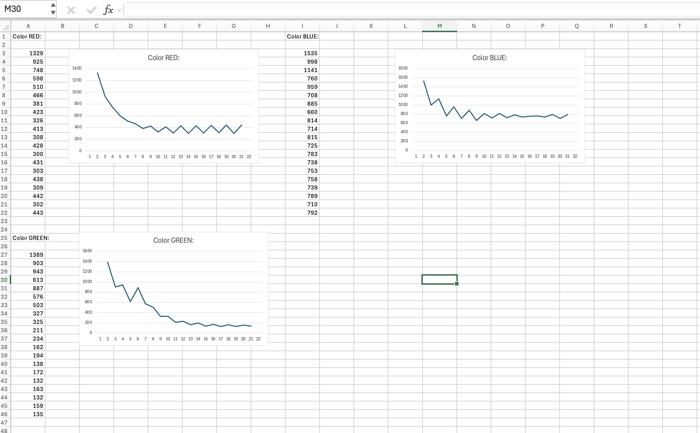

# ใบงานปฏิบัติการ สัปดาห์ที่ 4 การทดลองย่อยที่  2

### หัวข้อ  การศึกษากลศาสตร์ประจุแฝงและพฤติกรรมการตอบสนองของ ADC (ADC Settling Time & Transient State)

### 1. วัตถุประสงค์

1. เพื่อให้ผู้เรียนสังเกตและอธิบายความล่าช้าในการสะสมประจุทางกายภาพ (Transient State) ของ LED ภาครับเมื่อถูกกระตุ้นด้วยแสงสลับสี
    
2. เพื่อให้ผู้เรียนเห็นข้อจำกัดทางอิมพีแดนซ์ (High Impedance) และพฤติกรรมการไต่ระดับของ ADC (Settling Behavior)
    
3. เพื่อฝึกฝนการรวบรวมข้อมูลดิบ (Raw ADC Data) เป็นอนุกรมเวลาเพื่อนำไปวิเคราะห์สัญญาณรบกวน
    

###  2. อุปกรณ์ที่ใช้ในการทดลอง

1. บอร์ดไมโครคอนโทรลเลอร์ ESP32-C6 จำนวน 1 บอร์ด
    
2. หลอด LED RGB ภาคส่ง (ต่อขา GPIO4, GPIO5, GPIO6 ร่วมกับตัวต้านทานจำกัดกระแส)
    
3. หลอด LED สีเดี่ยว ภาครับ (ต่อขาอนาล็อกเข้ากับ **GPIO2 / ADC1 Channel 2**)
    
4. โฟโต้บอร์ดและสายจัมเปอร์
    


###  3. คำอธิบายโจทย์การทดลอง

โปรแกรมจะสั่งเปิดไฟ LED ภาคส่งทีละสี (R -> G -> B) สีละ **2.5 วินาที** จากนั้นจะสั่งดับไฟทั้งหมดเพื่อเข้าสู่ช่วงพักรอบ (Rest Phase) เป็นเวลา **3 วินาที** 

ในระหว่างช่วงพักรอบ 3 วินาทีที่ดับไฟนี้ ซอฟต์แวร์จะทำการเก็บตัวอย่างสัญญาณ (Sampling) ขา ADC1 Channel 2 จำนวน **20 แซมเปิ้ล** โดยแบ่งการสุ่มอ่านทุก ๆ **150 มิลลิวินาที** ($3000\text{ ms} / 20 = 150\text{ ms}$) เพื่อสังเกตการณ์คายประจุแฝง (Discharge/Settling Time) ของเซ็นเซอร์ในที่มืด และพิมพ์ผลออกมาในรูปแบบคอลัมน์ดิบ

#### 3.1 วงจรการทดลอง


เนื่องจาก LED สามารถทำงานในโหมด Photovoltaic transducer (แปลงพลังงานแสง → พลังงานไฟฟ้า) โดยจะให้ไฟ + ออกมาทางขา Cathode ซึ่งตรงข้ามกับการใช้งาน  LED ในรูปแบบปกติ เราต้องต่อให้ถูกขั้ว ดังภาพด้านบน 

**วงจรของฝั่ง TX ยังคงเดิม**

####  3.2 ซอร์สโค้ดการทดลอง (`main.c`)

```C
#include <stdio.h>
#include "freertos/FreeRTOS.h"
#include "freertos/task.h"
#include "driver/gpio.h"
#include "esp_log.h"
#include "esp_adc/adc_oneshot.h"

static const char *TAG = "LAB2_ADC_SETTLING";

// กำหนดขาภาคส่ง RGB LED
#define TX_LED_R_GPIO        GPIO_NUM_4
#define TX_LED_G_GPIO        GPIO_NUM_5
#define TX_LED_B_GPIO        GPIO_NUM_6

// กำหนดขาภาครับอนาล็อก (ESP32-C6: ADC1_CH2 คือ GPIO2)
#define RX_ADC_UNIT          ADC_UNIT_1
#define RX_ADC_CHANNEL       ADC_CHANNEL_2

#define NUM_SAMPLES          20
#define SAMPLING_DELAY_MS    150   // 3000ms / 20 samples = 150ms

void init_hardware(adc_oneshot_unit_handle_t *adc_handle)
{
    // 1. ตั้งค่าขาเอาต์พุตดิจิทัลสำหรับควบคุม LED RGB
    gpio_config_t io_conf = {
        .pin_bit_mask = (1ULL << TX_LED_R_GPIO) | (1ULL << TX_LED_G_GPIO) | (1ULL << TX_LED_B_GPIO),
        .mode = GPIO_MODE_OUTPUT,
        .pull_up_en = GPIO_PULLUP_DISABLE,
        .pull_down_en = GPIO_PULLDOWN_DISABLE,
        .intr_type = GPIO_INTR_DISABLE
    };
    gpio_config(&io_conf);

    // ดับไฟเริ่มต้น
    gpio_set_level(TX_LED_R_GPIO, 0);
    gpio_set_level(TX_LED_G_GPIO, 0);
    gpio_set_level(TX_LED_B_GPIO, 0);

    // 2. ตั้งค่าหน่วย ADC Unit 1 ธรรมดา (ไม่มีการ Calibrate เพื่อดูบิตดิบ)
    adc_oneshot_unit_init_cfg_t init_config = {
        .unit_id = RX_ADC_UNIT,
        .clk_src = ADC_DIGI_CLK_SRC_DEFAULT,
    };
    ESP_ERROR_CHECK(adc_oneshot_new_unit(&init_config, adc_handle));

    // 3. ตั้งค่าขาสัญญาณอนาล็อก ความละเอียดเริ่มต้น (12 บิต: 0 - 4095)
    adc_oneshot_chan_cfg_t chan_config = {
        .bitwidth = ADC_BITWIDTH_DEFAULT,
        .atten = ADC_ATTEN_DB_12, // รองรับช่วงระดับแรงดันเต็มพิกัด 3.3V
    };
    ESP_ERROR_CHECK(adc_oneshot_config_channel(*adc_handle, RX_ADC_CHANNEL, &chan_config));
}

// ฟังก์ชันจำลองวงจรอ่านค่าดิบแบบอนุกรมเวลาในช่วงสลับสีไฟ
void sample_and_print(adc_oneshot_unit_handle_t adc_handle, const char* phase_name)
{
    printf("Color %s:\n", phase_name);
    printf("No, ADC Raw\n");
    
    // ทำการสุ่มอ่าน 20 แซมเปิ้ล โดยเก็บค่า adc ต่อเนื่องทุก 150ms 
    for (int i = 1; i <= NUM_SAMPLES; i++) {
        int raw_value = 0;
        ESP_ERROR_CHECK(adc_oneshot_read(adc_handle, RX_ADC_CHANNEL, &raw_value));
        
        // พิมพ์ค่าดิบในรูปแบบ CSV ฟอร์แมตตามข้อกำหนด
        printf("%d, %d\n", i, raw_value);
        
        vTaskDelay(pdMS_TO_TICKS(SAMPLING_DELAY_MS));
    }
}

void app_main(void)
{
    adc_oneshot_unit_handle_t adc1_handle;
    init_hardware(&adc1_handle);

    ESP_LOGI(TAG, "Transient Observation System Online.");
    printf("==============================================================\n");

    while (1) {
        // --- รอบไฟสีแดง ---
        gpio_set_level(TX_LED_R_GPIO, 1);
        vTaskDelay(pdMS_TO_TICKS(2500)); // เปล่งแสงนาน 2.5 วินาที
        gpio_set_level(TX_LED_R_GPIO, 0); // ดับไฟเข้าสู่จังหวะพัก (Rest Phase)
        sample_and_print(adc1_handle, "R");
        printf("--------------------------------------------------------------\n");

        // --- รอบไฟสีเขียว ---
        gpio_set_level(TX_LED_G_GPIO, 1);
        vTaskDelay(pdMS_TO_TICKS(2500)); 
        gpio_set_level(TX_LED_G_GPIO, 0); 
        sample_and_print(adc1_handle, "G");
        printf("--------------------------------------------------------------\n");

        // --- รอบไฟสีน้ำเงิน ---
        gpio_set_level(TX_LED_B_GPIO, 1);
        vTaskDelay(pdMS_TO_TICKS(2500)); 
        gpio_set_level(TX_LED_B_GPIO, 0); 
        sample_and_print(adc1_handle, "B");
        printf("==============================================================\n");
    }
}
```

#### 3.3  ไฟล์โปรเจกต์ (`main/CMakeLists.txt`)

```CMake
idf_component_register(SRCS "main.c"
                    INCLUDE_DIRS "."
                    REQUIRES esp_adc driver)
```

### ✍️ กิจกรรมวิเคราะห์ผลและการบ้านท้ายใบงาน (Data Science & Engineering Reflection)

1. **การพล็อตพฤติกรรมทางกายภาพ (Transient Response Curve):**
    
    ให้นักศึกษาก๊อปปี้ข้อมูลตัวเลขชุดคู่อันดับ `No, ADC Raw` จาก Serial Monitor ทั้งหมดนำไปวางในโปรแกรม **Microsoft Excel** หรือ **Google Sheets** จากนั้นทำการพล็อตกราฟเส้น (Line Chart) โดยให้แกน X เป็นลำดับแซมเปิ้ล (1-20) และแกน Y เป็นค่าดิบของ ADC และแนบรูปกราฟลงในเล่มรายงาน
    
    

2. **คำถามนำเพื่อการวิเคราะห์เชิงระบบ (Critical Thinking):**
1. จากกราฟที่พล๊อตออกมา นักศึกษาสังเกตเห็นแนวโน้มตัวเลขของค่า ADC ตั้งแต่แซมเปิ้ลที่ 1 ไต่ระดับลงมาหรือขึ้นไปจนถึงแซมเปิ้ลที่ 20 อย่างไร?

คำตอบ:
จากกราฟพบว่าค่า ADC ในช่วงแรกหลังจากดับไฟ LED มีการเปลี่ยนแปลงอย่างชัดเจน โดยค่าที่อ่านได้ในแซมเปิ้ลแรกมีค่าสูงกว่าหรือแตกต่างจากค่าปกติ เนื่องจากยังมีประจุไฟฟ้าหลงเหลืออยู่ใน LED ภาครับและวงจร ADC ทำให้เกิดช่วง Transient State

เมื่อทำการเก็บข้อมูลต่อเนื่อง ค่า ADC จะค่อย ๆ ลดลง (หรือเปลี่ยนเข้าสู่ค่าคงที่ขึ้นอยู่กับสภาพแสงและวงจรที่ใช้) เนื่องจากประจุสะสมภายในตัว LED และวงจรอินพุต ADC ค่อย ๆ คายประจุออก จนเข้าสู่ระดับที่มีความเสถียรมากขึ้นในช่วงแซมเปิ้ลท้าย ๆ

2. สัญญาณไฟฟ้าเข้าสู่ความนิ่ง (Settling) ที่แซมเปิ้ลใด หรือใช้เวลากี่มิลลิวินาที?

คำตอบ:
จากหลักการทดลอง ค่า ADC จะเริ่มเข้าสู่สภาวะคงที่เมื่อผ่านช่วง Transient ไปแล้ว โดยทั่วไปสามารถพิจารณาได้จากช่วงที่ค่าของ ADC มีการเปลี่ยนแปลงน้อยมากติดต่อกันหลายแซมเปิ้ล

จากการทดลองที่มีการ Sampling ทุก 150 ms

ตัวอย่างเช่น หากพบว่าค่า ADC เริ่มนิ่งประมาณแซมเปิ้ลที่ 10

เวลาที่ใช้ในการ Settling คือ

10×150=1500ms

ดังนั้นสัญญาณเข้าสู่ความนิ่งประมาณ 1.5 วินาทีหลังจากดับ LED

(นักศึกษาควรเปลี่ยนเลขแซมเปิ้ลให้ตรงกับกราฟจริงของตนเอง)

3. ความลาดเอียงของเส้นกราฟที่เกิดขึ้นในช่วงแรกของการสลับสถานะไฟนี้ เป็นหลักฐานเชิงประจักษ์สะท้อนข้อจำกัดคุณสมบัติทางกายภาพใดของรอยต่อ PN บน LED ภาครับ และโครงสร้างตัวเก็บประจุสุ่มสัญญาณภายในไมโครคอนโทรลเลอร์?

คำตอบ:

ความลาดเอียงของกราฟในช่วงแรกแสดงให้เห็นถึงพฤติกรรมการตอบสนองที่ไม่ทันทีของอุปกรณ์ เนื่องจาก LED ภาครับทำงานเป็นตัวแปลงพลังงานแสงเป็นไฟฟ้า (Photovoltaic Transducer)

รอยต่อ PN Junction ภายใน LED มีคุณสมบัติเป็นเสมือนตัวเก็บประจุขนาดเล็ก ทำให้เกิดการสะสมและคายประจุเมื่อระดับแสงเปลี่ยนแปลง ส่งผลให้แรงดันเอาต์พุตไม่เปลี่ยนทันที

นอกจากนี้วงจร ADC ภายใน ESP32 มีวงจร Sample and Hold Capacitor ซึ่งต้องใช้เวลาในการชาร์จและคายประจุผ่านอิมพีแดนซ์สูงของแหล่งสัญญาณ ทำให้เกิดปรากฏการณ์ ADC Settling Time

ดังนั้นกราฟที่ค่อย ๆ เปลี่ยนแปลงเป็นหลักฐานของข้อจำกัดทางกายภาพของทั้ง LED Sensor และวงจร ADC

4. หากต้องการหาค่าเฉลี่ยของระดับแรงดันสะท้อนที่แท้จริง โดยไม่ให้ Transient State ทำให้ค่าสถิติเพี้ยน ควรเลือกแซมเปิ้ลช่วงใด หรือควรเขียนโปรแกรมอย่างไร?

คำตอบ:

ควรหลีกเลี่ยงข้อมูลในช่วงแรกหลังจากดับ LED เนื่องจากเป็นช่วง Transient State ที่ค่ากำลังเปลี่ยนแปลง

วิธีที่เหมาะสมคือเลือกใช้ค่าจากช่วงท้ายของการ Sampling เช่น

แซมเปิ้ลที่ 10–20
หรือ
แซมเปิ้ลที่ค่ามีการเปลี่ยนแปลงน้อยที่สุด

เพื่อใช้คำนวณค่าเฉลี่ย เนื่องจากเป็นช่วงที่สัญญาณเข้าสู่ Steady State แล้ว

ในด้านการเขียนโปรแกรม สามารถแก้ไขได้โดยเพิ่มเวลาหน่วงหลังดับ LED เช่น

gpio_set_level(TX_LED_R_GPIO, 0);
vTaskDelay(pdMS_TO_TICKS(1000));

จากนั้นจึงเริ่มอ่าน ADC เพื่อหลีกเลี่ยงผลกระทบจาก Settling Time

หรือสามารถอ่านค่าหลายครั้งแล้วทิ้งค่าชุดแรก (Discard Initial Samples) ก่อนนำข้อมูลที่เหลือไปคำนวณค่าเฉลี่ย

link youtube : https://youtube.com/sho  rts/3AsDOgIRFFU?si=Kcduabko3f1dqnSQ