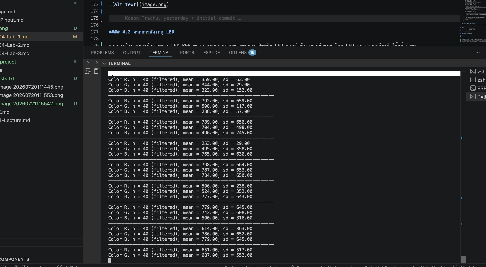

# ใบงานปฏิบัติการ สัปดาห์ที่ 4 การทดลองย่อยที่  3


### หัวข้อ: การประมวลผลสัญญาณเชิงสถิติและการแปลงข้อมูลสู่โลกดิจิทัล (Robust Statistical Filtering)

### 1.  วัตถุประสงค์

1. เพื่อให้ผู้เรียนประยุกต์ใช้คณิตศาสตร์และสถิติ (Mean & SD) ในการกรองสัญญาณรบกวน (Noise Filter) บนระบบสมาร์ตเซ็นเซอร์
    
2. เพื่อให้ผู้เรียนเข้าใจกลไกการคัดแยกข้อมูลผิดปกติ (Outlier Rejection) ผ่านอัลกอริทึม **Trimmed Mean** บนไมโครคอนโทรลเลอร์
    
3. เพื่อสร้างข้อมูลดิจิทัลที่สะอาด มีความเสถียร และระบุหน่วยกำกับ (Metadata) มิลลิโวลต์ (mV) ได้ถูกต้องตามหลักการแปลงโลกกายภาพสู่โลกดิจิทัล
    

### 2. อุปกรณ์ที่ใช้ในการทดลอง

1. บอร์ดไมโครคอนโทรลเลอร์ ESP32-C6 จำนวน 1 บอร์ด
    
2. หลอด LED RGB ภาคส่ง (GPIO4, GPIO5, GPIO6) และหลอด LED สีเดี่ยว ภาครับ (**GPIO2 / ADC1 CH2**)
    
3. โฟโต้บอร์ด ตัวต้านทาน และสายจัมเปอร์
    

### 3. คำอธิบายโจทย์การทดลอง

ในทางวิศวกรรม การวัดค่าสัญญาณอนาล็อกจากเซ็นเซอร์ที่มีอิมพีแดนซ์สูงจะเกิดสภาวะชั่วครู่ (Transient State) และนอยส์ฉับพลัน  ในใบงานนี้ ซอฟต์แวร์จะส่งสัญญาณสลับไฟ RGB สีละ **2.5 วินาที** จากนั้นจะเว้นระยะพักระบบ **3 วินาที** เพื่อดับไฟระบายประจุ

ในกระบวนการประมวลผลสัญญาณ สัญญาณจะถูกสุ่มเก็บค่าดิบ (Raw Data) จำนวน **50 แซมเปิ้ล (n=50)** นำมาทำ **Sorting** เรียงจากน้อยไปมาก แล้วตัดข้อมูลขอบบนและขอบล่างออกฝั่งละ **10%** (ฝั่งละ 5 ตัวอย่าง เหลือข้อมูลใช้งานจริง 40 แซมเปิ้ล) เพื่อหาค่าเฉลี่ยและ SD ของบิต Raw data ที่นิ่งที่สุด แล้วจึงนำค่านั้นส่งต่อให้โมดูล **`eFuse Line Fitting Calibration`** เพื่อแปลงหน่วยเป็นมิลลิโวลต์ (mV) สรุปรายงานในบรรทัดเดียว

####  3.1 ตัวอย่างซอร์สโค้ดการทดลอง (`main.c`)


```C
#include <stdio.h>
#include <math.h>
#include <stdlib.h>
#include "freertos/FreeRTOS.h"
#include "freertos/task.h"
#include "driver/gpio.h"
#include "esp_log.h"
#include "esp_adc/adc_oneshot.h"
#include "esp_adc/adc_cali.h"
#include "esp_adc/adc_cali_scheme.h"

static const char *TAG = "LAB3_STAT_FILTER";

#define TX_LED_R_GPIO        GPIO_NUM_4
#define TX_LED_G_GPIO        GPIO_NUM_5
#define TX_LED_B_GPIO        GPIO_NUM_6

#define RX_ADC_UNIT          ADC_UNIT_1
#define RX_ADC_CHANNEL       ADC_CHANNEL_2
#define V_REF                3300  

#define NUM_SAMPLES          50    // สุ่มเก็บ 50 แซมเปิ้ล

static adc_cali_handle_t adc_cali_handle = NULL;
static bool do_cali = false;

// ฟังก์ชันเปรียบเทียบข้อมูลสำหรับการทำ Sorting ด้วย qsort
int compare_ints(const void *a, const void *b) {
    return (*(int*)a - *(int*)b);
}

void init_hardware(adc_oneshot_unit_handle_t *adc_handle)
{
    // ตั้งค่าขาขับ LED ดิจิทัลเอาต์พุต
    gpio_config_t io_conf = {
        .pin_bit_mask = (1ULL << TX_LED_R_GPIO) | (1ULL << TX_LED_G_GPIO) | (1ULL << TX_LED_B_GPIO),
        .mode = GPIO_MODE_OUTPUT,
    };
    gpio_config(&io_conf);
    
    gpio_set_level(TX_LED_R_GPIO, 0);
    gpio_set_level(TX_LED_G_GPIO, 0);
    gpio_set_level(TX_LED_B_GPIO, 0);

    // ตั้งค่าพอร์ต ADC
    adc_oneshot_unit_init_cfg_t init_config = { .unit_id = RX_ADC_UNIT, .clk_src = ADC_DIGI_CLK_SRC_DEFAULT };
    ESP_ERROR_CHECK(adc_oneshot_new_unit(&init_config, adc_handle));
    adc_oneshot_chan_cfg_t chan_config = { .bitwidth = ADC_BITWIDTH_DEFAULT, .atten = ADC_ATTEN_DB_12 };
    ESP_ERROR_CHECK(adc_oneshot_config_channel(*adc_handle, RX_ADC_CHANNEL, &chan_config));

    // ลงทะเบียนฮาร์ดแวร์ปรับเทียบแรงดันจากโรงงาน
#if ADC_CALI_SCHEME_LINE_FITTING_SUPPORTED
    adc_cali_line_fitting_config_t cali_config = { .unit_id = RX_ADC_UNIT, .atten = ADC_ATTEN_DB_12, .bitwidth = ADC_BITWIDTH_DEFAULT };
    if (adc_cali_create_scheme_line_fitting(&cali_config, &adc_cali_handle) == ESP_OK) {
        do_cali = true;
    }
#endif
}

void process_color_sensing(adc_oneshot_unit_handle_t adc_handle, const char *color_name)
{
    int raw_samples[NUM_SAMPLES];
    
    // หน่วงเวลารอให้ระดับกระแสไฟฟ้าผ่านเสถียรเข้าสู่ Steady State ชั่วครู่
    vTaskDelay(pdMS_TO_TICKS(300)); 

    // 1. สุ่มเก็บระดับประจุบิตดิบความเร็วสูง (ห่างกันตัวอย่างละ 10ms)
    
    for (int i = 0; i < NUM_SAMPLES; i++) {
        int raw_value = 0;
        ESP_ERROR_CHECK(adc_oneshot_read(adc_handle, RX_ADC_CHANNEL, &raw_value));
        raw_samples[i] = raw_value;
        vTaskDelay(pdMS_TO_TICKS(10)); 
        // ถ้านักศึกษาใช้ค่านี้แล้วได้ผลไม่ดี หรือไม่น่าพอใจ สามารถปรับ vTaskDelay(pdMS_TO_TICKS(10)); ให้มีเวลาหน่วงเพิ่มขึ้น
    }

    // 2. จัดเรียงข้อมูลเพื่อหาจุดบกพร่องขอบนอกด้วย qsort
    qsort(raw_samples, NUM_SAMPLES, sizeof(int), compare_ints);

    // 3. ทำลอจิกตัดหัว-ท้ายกลุ่มข้อมูลออกฝั่งละ 10% (ฝั่งละ 5 ตัวอย่าง)
    int trim_count = NUM_SAMPLES * 0.10; 
    int valid_count = NUM_SAMPLES - (2 * trim_count);
    
    double raw_sum = 0.0;
    for (int i = trim_count; i < NUM_SAMPLES - trim_count; i++) {
        raw_sum += raw_samples[i];
    }

    // 4. คำนวณค่าเฉลี่ยทางสถิติระดับบิต raw
    double mean_raw = raw_sum / valid_count;

    // 5. คำนวณค่าส่วนเบี่ยงเบนมาตรฐาน (SD) ระดับบิต raw
    double variance_sum = 0.0;
    for (int i = trim_count; i < NUM_SAMPLES - trim_count; i++) {
        variance_sum += pow((raw_samples[i] - mean_raw), 2);
    }
    double sd_raw = sqrt(variance_sum / (valid_count - 1));

    // 6. ส่งข้อมูลที่สะอาดเข้ากระบวนการแปลงหน่วยเป็นมิลลิโวลต์ (mV Metadata)
    int final_voltage_mv = 0;
    int sd_voltage_mv = 0;

    if (do_cali) {
        adc_cali_raw_to_voltage(adc_cali_handle, (int)mean_raw, &final_voltage_mv);
        adc_cali_raw_to_voltage(adc_cali_handle, (int)sd_raw, &sd_voltage_mv);
        
        int zero_offset = 0;
        adc_cali_raw_to_voltage(adc_cali_handle, 0, &zero_offset);
        sd_voltage_mv = abs(sd_voltage_mv - zero_offset);
    } else {
        final_voltage_mv = ((int)mean_raw * V_REF) / 4095;
        sd_voltage_mv = ((int)sd_raw * V_REF) / 4095;
    }

    // ป้องกันกรณีแสงมืดสนิทและค่าแกว่ง  ควบคุมความเงียบเป็น 0V
    if (mean_raw <= 2.0) {
        final_voltage_mv = 0;
        sd_voltage_mv = 0;
    }

    // 7. พิมพ์ผลลัพธ์ข้อมูลเชิงสถิติออกทาง Serial Port  
    printf("Color %s, n = %d (filtered), mean = %.2f, sd = %.2f\n", 
           color_name, valid_count, (double)final_voltage_mv, (double)sd_voltage_mv);
}

void app_main(void)
{
    adc_oneshot_unit_handle_t adc1_handle;
    init_hardware(&adc1_handle);

    ESP_LOGI(TAG, "Statistical Signal Processing System Online.");
    printf("==============================================================\n");

    while (1) {
        // เฟสเปิดสีแดง
        gpio_set_level(TX_LED_R_GPIO, 1);
        vTaskDelay(pdMS_TO_TICKS(2500)); 
        gpio_set_level(TX_LED_R_GPIO, 0); 
        process_color_sensing(adc1_handle, "R");

        // เฟสเปิดสีเขียว
        gpio_set_level(TX_LED_G_GPIO, 1);
        vTaskDelay(pdMS_TO_TICKS(2500)); 
        gpio_set_level(TX_LED_G_GPIO, 0); 
        process_color_sensing(adc1_handle, "G");

        // เฟสเปิดสีน้ำเงิน
        gpio_set_level(TX_LED_B_GPIO, 1);
        vTaskDelay(pdMS_TO_TICKS(2500)); 
        gpio_set_level(TX_LED_B_GPIO, 0); 
        process_color_sensing(adc1_handle, "B");

        // ดับไฟทุกดวงและพักรอบระบบ 3 วินาที เพื่อรีเซ็ตพลังงานทางกายภาพ
        printf("--------------------------------------------------------------\n");
        vTaskDelay(pdMS_TO_TICKS(3000));
    }
}
```

#### 3.2 ไฟล์โปรเจกต์ (`main/CMakeLists.txt`)


```CMake
idf_component_register(SRCS "main.c"
                    INCLUDE_DIRS "."
                    REQUIRES esp_adc driver)

#  link ตัวเชื่อมคอมไพเลอร์เข้ากับ Library ฟังก์ชันคณิตศาสตร์สถิติ <math.h>
component_compile_options(-lm)
target_link_libraries(${COMPONENT_LIB} PRIVATE m)
```


#### 3.3 ตัวอย่างเอาต์พุต
```
==============================================================
Color R, n = 40 (filtered), mean = 321.00, sd = 7.00
Color G, n = 40 (filtered), mean = 1153.00, sd = 8.00
Color B, n = 40 (filtered), mean = 510.00, sd = 12.00
--------------------------------------------------------------
Color R, n = 40 (filtered), mean = 28.00, sd = 13.00
Color G, n = 40 (filtered), mean = 1007.00, sd = 21.00
Color B, n = 40 (filtered), mean = 15.00, sd = 11.00
--------------------------------------------------------------
Color R, n = 40 (filtered), mean = 0.00, sd = 0.00
Color G, n = 40 (filtered), mean = 1077.00, sd = 16.00
Color B, n = 40 (filtered), mean = 469.00, sd = 25.00
--------------------------------------------------------------
Color R, n = 40 (filtered), mean = 427.00, sd = 15.00
Color G, n = 40 (filtered), mean = 1143.00, sd = 8.00
Color B, n = 40 (filtered), mean = 366.00, sd = 12.00
```


### 4. รายงานการทดลองและเกณฑ์การตรวจแล็บ

1. **การคัดกรองข้อมูลคุณภาพ (Data Selection Report):**
    
    ให้นักศึกษาสังเกตค่าสถิติที่แสดงผลบนหน้าจอต่อเนื่องกัน 5 รอบวงลูป ให้นักศึกษาทำเครื่องหมายคัดเลือกเฉพาะชุดข้อมูลที่ผ่านเกณฑ์คุณภาพวิศวกรรมลงในตาราง โดยมีข้อกำหนดว่า **"ชุดข้อมูลที่น่าเชื่อถือ จะต้องมีค่า SD ต่ำสอดคล้องกันทุกเฟสสี (เช่น อยู่ในช่วง 2.00 ถึง 35.00) และต้องไม่มีค่าเฉลี่ยหรือค่า SD ใดหลุดเป็น 0.00 ในขณะที่มีการส่องสว่างส่งแสงข้ามช่องสัญญาณ"**
    
    
2. **คำถามเชิงวิเคราะห์ (Engineering Evaluation):**
    
1. หลังจากเปลี่ยนสถาปัตยกรรมซอฟต์แวร์มาใช้ระบบกรองบิตดิบแบบ Trimmed Mean ก่อนทำการแปลงแรงดัน เปรียบเทียบกับพฤติกรรมอนุกรมเวลาในใบงานที่ 2 แล้ว ค่าความผันผวน (SD) มีการพัฒนาไปในทางที่ดีขึ้นอย่างไร?

คำตอบ

หลังจากใช้วิธี Trimmed Mean ซึ่งเป็นการตัดค่าที่สูงและต่ำผิดปกติ (Outliers) ออกก่อนนำข้อมูลมาหาค่าเฉลี่ย พบว่าค่าความผันผวนหรือ Standard Deviation (SD) ลดลงอย่างเห็นได้ชัดเมื่อเทียบกับใบงานที่ 2 เนื่องจากค่าที่เกิดจากสัญญาณรบกวนหรือการอ่าน ADC ที่ผิดปกติไม่ถูกนำมาคำนวณ ส่งผลให้ข้อมูลมีความเสถียรมากขึ้น ค่าเฉลี่ยที่ได้ใกล้เคียงกับค่าจริงมากขึ้น และกราฟมีความเรียบต่อเนื่อง เหมาะสำหรับการนำไปใช้งานควบคุมระบบจริง

2. ในการนำข้อมูลดิจิทัลนี้ไปใช้ควบคุมหุ่นยนต์แยกแยะวัตถุสีในโลกจริง เหตุใดการระบุหน่วยวัดร่วมประมวลผลในรูปของ แรงดันทางกายภาพ (mV) จึงมีความสำคัญและเสถียรมากกว่าการใช้ข้อมูลระดับบิตดิจิทัลดิบ (Raw Scale 0–4095) ตรง ๆ? ให้แปรผลโดยอิงความรู้จากหัวข้อ "สองโลกที่แตกต่าง"

คำตอบ

ตามแนวคิดเรื่อง "สองโลกที่แตกต่าง" โลกภายนอกเป็นโลกของปริมาณทางกายภาพ เช่น แสง สี และแรงดันไฟฟ้า ขณะที่ไมโครคอนโทรลเลอร์ทำงานในโลกดิจิทัลซึ่งรับรู้ข้อมูลเป็นเพียงตัวเลขบิต (Raw ADC 0–4095)

การแปลงข้อมูลให้อยู่ในรูป แรงดันไฟฟ้า (mV) มีความสำคัญ เพราะแรงดันเป็นหน่วยทางกายภาพที่สามารถอธิบายและเปรียบเทียบผลการวัดได้อย่างเป็นมาตรฐาน ไม่ขึ้นกับความละเอียดของ ADC หรือชนิดของไมโครคอนโทรลเลอร์ หากเปลี่ยนไปใช้บอร์ดที่มี ADC ความละเอียดต่างกัน (เช่น 10 บิต, 12 บิต หรือ 16 บิต) ค่า Raw จะเปลี่ยนไปทันที แม้ว่าระดับแรงดันจริงจะเท่าเดิม แต่เมื่อแปลงเป็นหน่วย mV แล้ว ค่าที่ได้ยังคงสอดคล้องกับแรงดันจริง

ดังนั้น การประมวลผลในหน่วย mV จึงช่วยให้ระบบหุ่นยนต์สามารถกำหนดเกณฑ์การจำแนกสีได้อย่างแม่นยำ สื่อสารข้อมูลระหว่างอุปกรณ์ต่าง ๆ ได้ง่าย ลดความคลาดเคลื่อนจากความแตกต่างของฮาร์ดแวร์ และทำให้ระบบมีความเสถียรและเชื่อถือได้มากกว่าการใช้ค่า Raw ADC โดยตรง


    link youtube: https://youtu.be/QSuOF47BK9Y?si=4uEZLD56BtuCjTQU